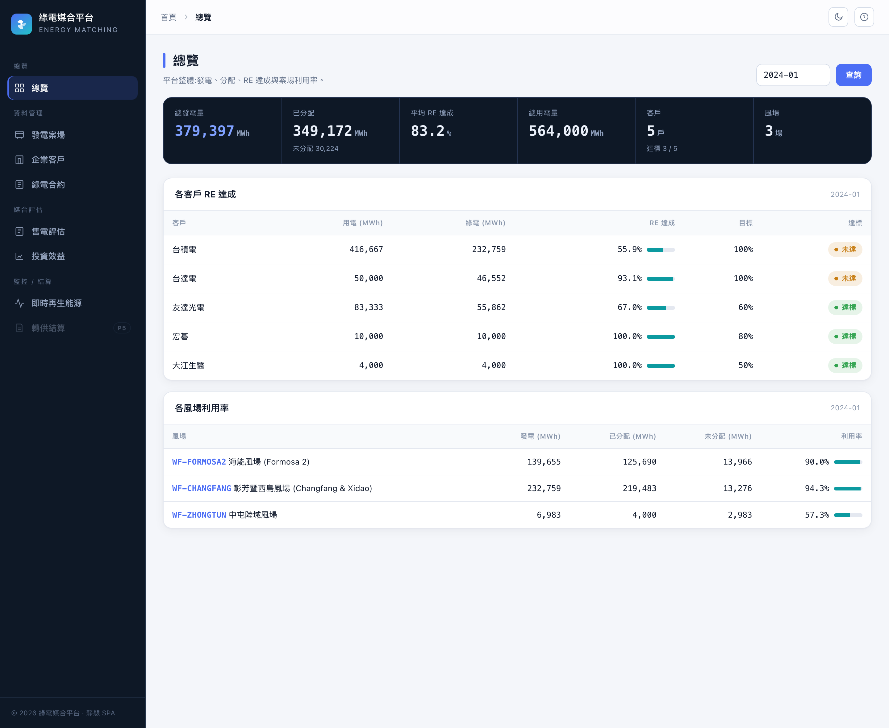
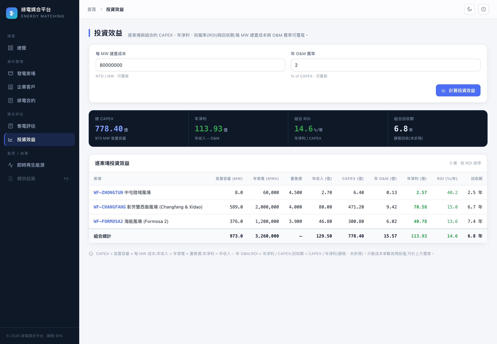
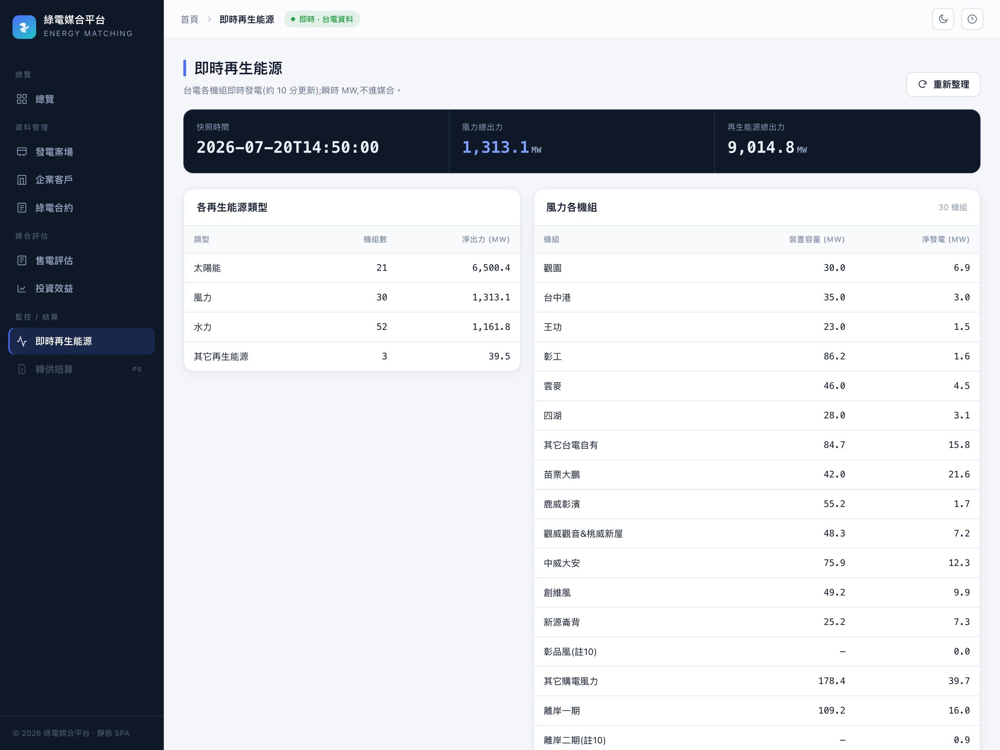
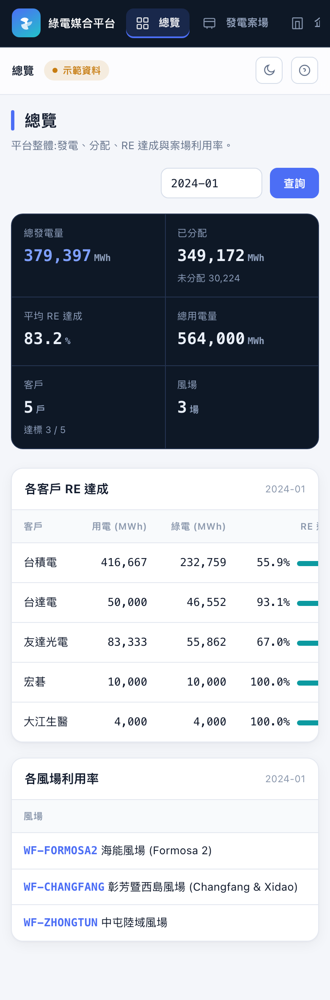
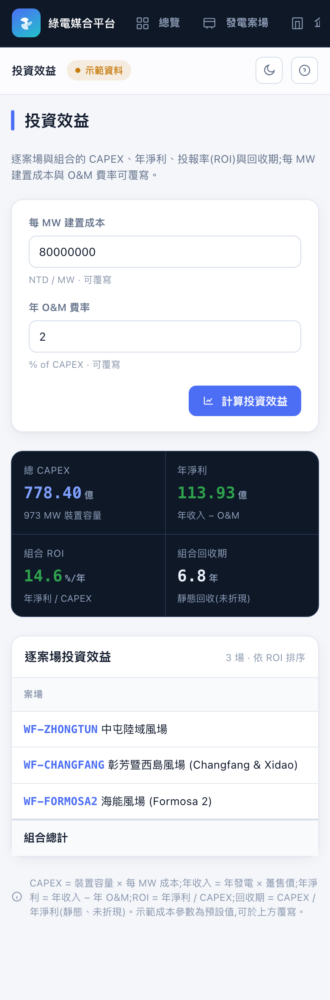

# Energy Matching Platform

A portfolio-ready **MVP for renewable-energy contract management, wind-power data
ingestion, green-energy allocation, and RE-target analysis** in Taiwan.

Built around a **pure, deterministic matching engine** and a clean layered
architecture (FastAPI · SQLAlchemy 2 · Pydantic 2 · Alembic · PostgreSQL),
with a dependency-free static web UI, Docker, CI, and a full test suite.

> ⚠️ **Demo data is simulated.** Not affiliated with Taipower, TSEC, or any
> energy company. This is a technical portfolio project, **not** a settlement,
> certificate-transfer, or trading system.

---

## Problem statement

Taiwanese corporates buying renewable energy via Corporate PPAs (轉供) need to
know: given each wind farm's *actual* generation, each company's *actual*
consumption, and a set of contracts with different volumes, shares and
priorities — **how much green energy does each company actually receive, and how
far is it from its RE target?**

A contract ratio is not the delivered energy. This platform models generation,
consumption, contracts and allocation as **separate** quantities and computes the
real, auditable result.

## Key features

- **Deterministic matching engine** — monthly allocation by contract priority,
  bounded by real generation, real consumption and contract caps; every
  allocation records *why* it was bounded. Same input ⇒ identical output.
- **RE-target analytics** — per-customer coverage %, gap to target, target-met;
  per-farm utilisation & unallocated surplus; per-period summaries.
- **REST API** (FastAPI + Swagger) with request/response schemas, validation,
  proper status codes and error handling.
- **Pluggable data sources** — CSV import, a deterministic `MockDataGenerator`,
  and a `PublicDataAdapter` placeholder (Phase 2) that will respect source ToS /
  robots.txt. No scraping, no fabricated "real" data.
- **Web UI** — a dependency-free static single-page app (HTML/CSS/vanilla JS)
  served same-origin by the API at `/app`: overview, wind farms, customers,
  contracts, a product-grade optimization evaluation, and live renewables.
- **Production-shaped tooling** — Alembic migrations, Docker Compose, Makefile,
  Ruff/Black/mypy, pre-commit, GitHub Actions CI, pytest (matching core ≥ 80 %).

## Architecture

```
app/
├── api/v1/        # FastAPI routers (wind-farms, customers, contracts,
│                  #   generation, consumption, matching, analytics)
├── schemas/       # Pydantic v2 request/response models
├── services/      # business logic & orchestration
├── matching/      # PURE deterministic engine (no I/O)
├── ingestion/     # CSV importer, DataSource interface, mock generator
├── repositories/  # generic CRUD over the ORM
├── models/        # SQLAlchemy 2.x entities
├── core/          # settings, domain exceptions
└── db/            # engine, session, declarative base
web/               # static SPA (index.html + styles.css + api.js + app.js)
alembic/           # migrations
data/sample/       # demo CSVs (3 farms, 5 customers, 8 contracts, 12 months)
```

Full diagrams in [`docs/architecture.md`](docs/architecture.md),
[`docs/domain-model.md`](docs/domain-model.md) (ERD), and
[`docs/matching-rules.md`](docs/matching-rules.md) (process flow).

## Matching logic (in one paragraph)

For a month, sum each farm's generation and each customer's consumption. Process
**active, in-window** contracts in order of `priority` (ties → `start_date` →
`contract_number`). Each contract gets
`min(farm remaining, customer remaining demand, contract cap)`, where the cap is
the tighter of its fixed volume and its % share of the farm's generation. A
farm's energy is never allocated twice; a customer never exceeds its consumption.
See [`docs/matching-rules.md`](docs/matching-rules.md).

## Quick start (local, no Docker)

Requires **Python 3.12**. [`uv`](https://docs.astral.sh/uv/) is preferred.

```bash
# 1. Install (uv preferred; falls back to python -m venv + pip)
make install
#   or manually:
#   uv venv --python 3.12 && uv pip install -e ".[dev]"

# 2. Load the demo data (SQLite by default)
make seed

# 3. Run the API  → http://localhost:8000/docs
make run

# 4. Open the web UI (served by the API) → http://localhost:8000/app/
```

### New web UI (static SPA)

A dependency-free, build-free single-page UI (HTML/CSS/vanilla JS) is served
**same-origin by the API** at **http://localhost:8000/app/** once `make run` is
up — no extra process, no Node build. It covers 總覽 (overview), 發電案場
(farms), 企業客戶 (customers), 綠電合約 (contracts), 即時再生能源 (live),
投資效益 (investment ROI / payback), and the flagship **最佳化評估** page (pick a
customer → one MILP run feeds a product-grade dual-sided result + per-farm detail
+ time-slot breakdown). Files
are in [`web/`](web/); the optimizer's `min_site_allocation_percent` /
`min_sites_per_customer` map to the reference solar tool's 最小匹配比例 / 最少匹配間數.

Trigger a matching run and inspect analytics:

```bash
curl -X POST http://localhost:8000/api/v1/matching/runs \
     -H 'Content-Type: application/json' -d '{"period":"2024-01"}'
curl 'http://localhost:8000/api/v1/analytics/customers?period=2024-01'
```

## Docker usage

Brings up PostgreSQL + the API (which also serves the SPA):

```bash
docker compose up --build          # or: make docker-up
make docker-seed                   # load demo data into the container DB
```

- Web UI (SPA) → http://localhost:8000/app/
- API / Swagger → http://localhost:8000/docs
- The API service runs `alembic upgrade head` on start.

## Cloud deployment

Two documented paths, both using the same `Dockerfile` + **Neon** Postgres:

- **Render** — one-click [`render.yaml`](render.yaml) blueprint (two web
  services). Guide: [`docs/deployment.md`](docs/deployment.md).
- **Google Cloud Run** — scale-to-zero, `asia-east1` (Taiwan). One-command
  script [`scripts/deploy_cloudrun.sh`](scripts/deploy_cloudrun.sh). Guide:
  [`docs/deployment-cloudrun.md`](docs/deployment-cloudrun.md).

## Local development

```bash
make test        # pytest + coverage on the matching core
make lint        # ruff + black --check + mypy
make format      # black + ruff --fix
make migrate     # alembic upgrade head
make revision m="add X"   # autogenerate a migration
pre-commit install        # enable the hooks
```

## Demo data

`data/sample/` contains a scenario designed to exercise every rule: 3 wind farms,
5 customers with different RE targets, 8 contracts (mixed priorities, one expired,
one pending), and 12 months of generation & consumption. Regenerate the monthly
series deterministically with:

```bash
python -m scripts.generate_sample_data
```

Example result for `2024-01` (`make seed` then run matching):

| Customer | Consumption | Allocated | RE % | Target | Met |
|----------|------------:|----------:|-----:|-------:|:---:|
| 台積電 TSMC | 416,667 | 232,759 | 55.9 % | 100 % | ✗ |
| 台達電 Delta | 50,000 | 46,552 | 93.1 % | 100 % | ✗ |
| 友達 AUO | 83,333 | 55,862 | 67.0 % | 60 % | ✓ |
| 宏碁 Acer | 10,000 | 10,000 | 100 % | 80 % | ✓ |
| 大江 TCI | 4,000 | 4,000 | 100 % | 50 % | ✓ |

Expired (`PPA-2020-007`) and pending (`PPA-2025-008`) contracts are skipped.

## Real data: Taipower wind open data

Besides the bundled demo, the seeder can load **real** wind generation from
Taiwan Power Company's monthly open dataset
([data.gov.tw #29961](https://data.gov.tw/dataset/29961), Government Open Data
Licence). It aggregates the per-turbine rows into one wind farm per station
(codes prefixed `TPC-`) and one monthly generation total, over a rolling window
of the most recent N months present in the data (default 12, may span calendar
years). These `TPC-` farms coexist with the `WF-` demo farms.

```bash
# Fetch the CSV live and load the last 12 months
python -m scripts.seed --reset --source taipower --fetch

# Or download the CSV once to data/taipower/wind_turbines.csv, then load offline
python -m scripts.seed --source taipower --months 24
#   --csv-path <path>   override the local CSV location
```

### Real-time renewables (live monitoring)

`GET /api/v1/live/renewables` reads Taipower's per-unit real-time dataset
([#8931](https://data.gov.tw/dataset/8931), ~10-min cadence) and returns the
current wind units and renewable-type totals — **instantaneous MW**, fetched
read-through with a short cache, never persisted and never used for matching.
`?force=true` bypasses the cache. The SPA's **即時再生能源** page renders it.

Taipower publishes only supply-side data, so customers / contracts / consumption
stay empty for this source. The dataset covers Taipower's own (mostly onshore)
stations — offshore IPP farms (Formosa, Changfang, …) are not included.

## API documentation

Interactive Swagger UI at `/docs`. Endpoints under `/api/v1`:

| Method | Path | Purpose |
|--------|------|---------|
| GET | `/health` | Health check |
| GET/POST | `/api/v1/wind-farms`, `/{id}` | Wind farms |
| GET/POST | `/api/v1/customers`, `/{id}` | Customers |
| GET/POST | `/api/v1/contracts`, `/{id}` | Contracts (PPA) |
| GET/POST | `/api/v1/generation`, `/generation/import` | Generation data + CSV import |
| GET/POST | `/api/v1/consumption`, `/consumption/import` | Consumption data + CSV import |
| POST/GET | `/api/v1/matching/runs`, `/runs/{id}` | Run & inspect matching |
| GET | `/api/v1/matching/results` | Allocation results |
| GET | `/api/v1/analytics/customers`, `/wind-farms`, `/summary` | Analytics |
| GET | `/api/v1/analytics/evaluation?customer_id=&start=&end=` | Dual-sided sales evaluation (seller gross margin + buyer RE%/cost) |
| GET | `/api/v1/matching/optimize?period=&min_sites=&min_site_allocation_percent=` | Global economic-optimization matching (MILP): maximize retailer gross margin with RE targets as constraints |
| GET | `/api/v1/matching/slots?period=` | Per-time-slot (Taipower TOU) matching: peak/half-peak/off-peak × summer/non-summer, cross-slot RE and per-slot economics |
| GET | `/api/v1/analytics/customer-optimization?customer_id=&period=&min_sites=&min_site_allocation_percent=&re_target_percent=&transfer_price_per_kwh=` | Unified per-customer optimization: one MILP run feeds the SPA's 最佳化評估 page (seller/buyer economics + per-farm + time-slot, all consistent) |

## Screenshots

Dependency-free static SPA served same-origin by the API at `/app/` (demo data,
light theme).

**總覽 (Overview)** — platform-wide generation, allocation, RE attainment and
per-farm utilisation for a period. The amber **示範資料** badge in the top bar
marks simulated demo data; it turns green (**即時 · 台電資料**) on the live
renewables page, which is the one real Taipower feed.



**投資效益 (Investment ROI / payback)** — per-farm and portfolio CAPEX, annual
net, ROI and static payback; per-MW build cost and O&M rate are overridable.



**即時再生能源 (Live renewables)** — the one **real** data source: Taipower's
public per-unit instantaneous generation (dataset 8931, ~10-min cadence), shown
read-through and never fed into the matching engine. The green **即時 · 台電資料**
badge marks it as live, in contrast to the amber 示範資料 on the demo pages.



**手機 / RWD** — the SPA is fully responsive: the sidebar collapses to a sticky
horizontal nav bar, KPI strips reflow to two columns, and wide tables scroll
inside their own cards (the page body never scrolls horizontally).

<p>
  
  &nbsp;
  
</p>

## Known limitations

- Monthly matching plus a Taipower three-tier time-of-use slot matcher
  (peak/half-peak/off-peak × summer/non-summer, `GET /matching/slots`), and a
  joint per-slot MILP with Taipower secondary (二次匹配) redistribution that
  minimises time-mismatch surplus (P4b). Full 8760-hour matching is future work.
- Two matching strategies: deterministic priority (greedy) and global economic
  optimization (MILP, `GET /matching/optimize`). The greedy engine is the audit
  baseline; the optimizer maximizes retailer gross margin under RE and structural
  constraints.
- No auth/multi-tenancy; demo-scale data.
- See [`docs/assumptions.md`](docs/assumptions.md) and
  [`docs/roadmap.md`](docs/roadmap.md).

## Data-source disclaimer

All bundled data is **simulated** for demonstration. Any future integration with
public open data must comply with the source website's terms of service and
access rules; this project does not bypass authentication, robots.txt, or rate
limits.

## Roadmap

Phase 1 MVP (this release) → Phase 2 public data & quality → Phase 3 optimisation
& portfolio → Phase 4 AI assistant. Details in [`docs/roadmap.md`](docs/roadmap.md).

## License

[MIT](LICENSE)

---

## 繁體中文摘要

以台灣企業綠電交易 (Corporate PPA / 轉供) 為情境的**作品集 MVP**：管理風力發電案場、
企業客戶、綠電合約，並以**可解釋、deterministic 的媒合引擎**，依「實際發電量、實際
用電量、合約上限與優先順序」計算每家企業每月實際取得的綠電與 **RE 目標達成率**。

- 技術棧：FastAPI · SQLAlchemy 2 · Pydantic 2 · Alembic · PostgreSQL,搭配零相依
  靜態 SPA 前端、Docker、GitHub Actions CI、Ruff/Black/mypy、pytest（媒合核心覆蓋率 ≥ 80%）。
- 快速開始：`make install` → `make seed` → `make run`（API + SPA)→ 開 http://localhost:8000/app/ 。
- 重要聲明：Demo 資料皆為**模擬資料**，亦非正式的結算、憑證移轉或交易系統。公開資料的使用須遵守來源網站規範，本專案不繞過
  任何驗證、robots.txt 或存取限制。
