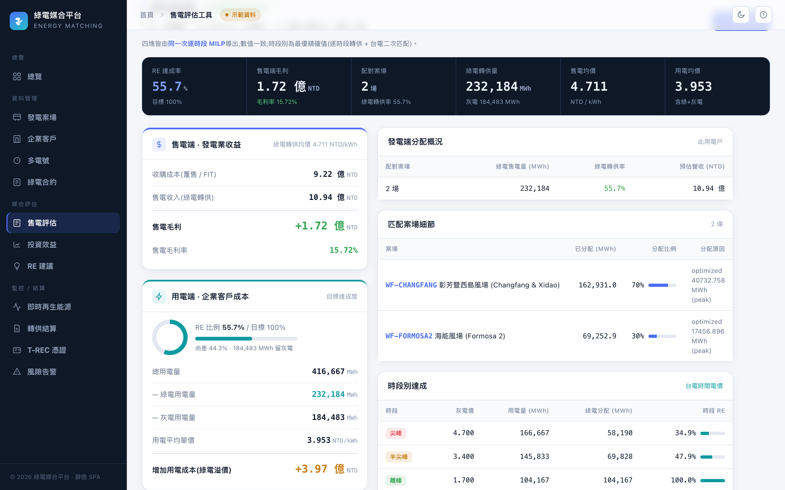
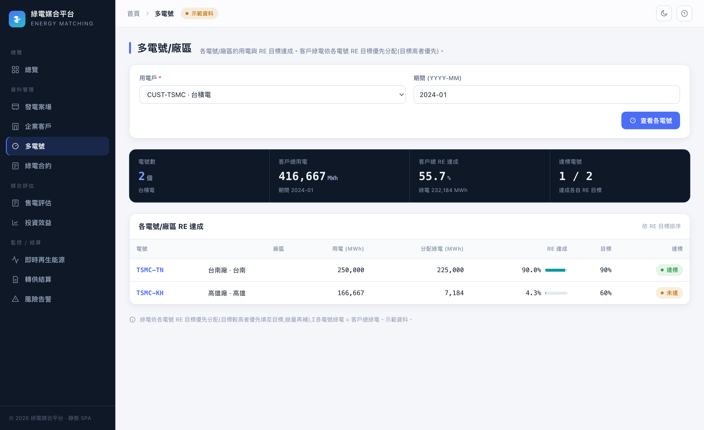
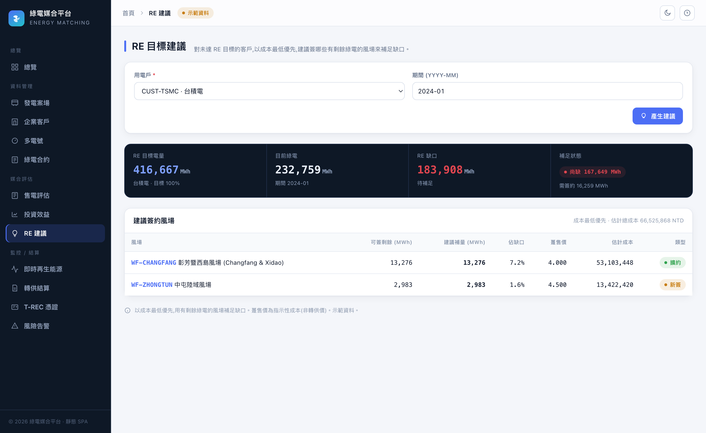
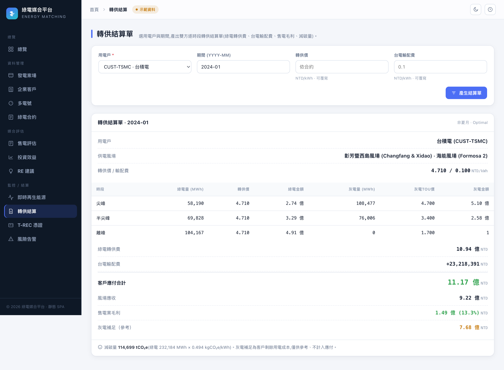
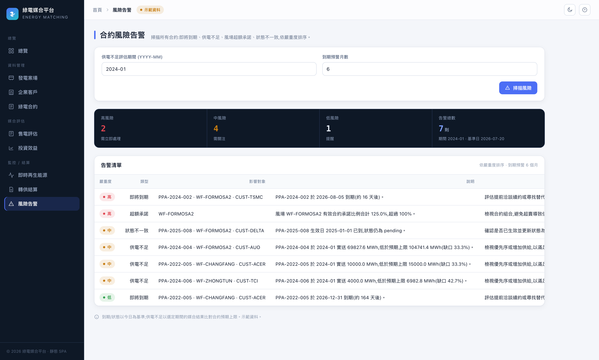
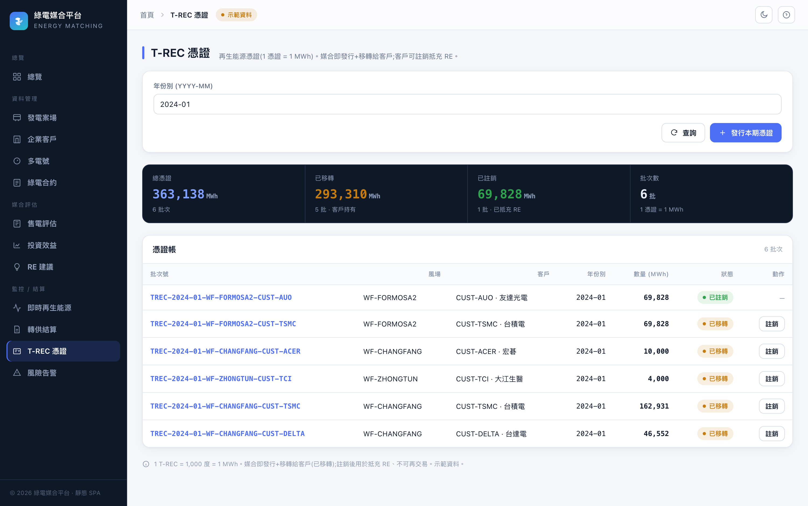

# 綠電媒合平台（Energy Matching Platform）

一個以台灣企業綠電轉供（Corporate PPA）為題的作品集專案。它把「風場實際發了多少電、
企業實際用了多少電、手上有哪些合約」這三件事拆開來各自計算，再用一套可重現、可稽核的
媒合引擎，算出每家企業每個月真正拿到多少綠電、離 RE 目標還差多遠——最後把整套決策流程
（媒合、售電評估、投資效益、轉供結算、憑證追蹤、風險告警）收成一個售電業會用得上的介面。

🔗 **線上 Demo：<https://emp-api-bxbe.onrender.com/app/>**　·　API 文件：`/docs`

> **聲明**：站上所有數字都是**模擬示範資料**，與台電、TSEC 或任何能源業者無關；
> 只有「即時再生能源」頁抓的是台電公開的即時資料。這是技術作品集，不是正式的結算、
> 憑證移轉或交易系統。

---

## 這個專案想解決什麼

合約上寫「佔某風場 70%」，不等於這家公司這個月真的拿到 70% 的綠電。實際拿到多少，取決於
風場當月發了多少、同一座風場還有沒有其他優先序更高的合約在搶、以及企業自己用了多少電。

多數試算把「合約比例」直接當成「已供綠電」，結果失真。這裡的做法是把發電、用電、合約、
分配當成四個獨立的量，照合約優先序逐一分配，並且**每一筆分配都記下它是被哪個上限卡住的**
（風場剩餘、客戶剩餘需求，還是合約上限）。同樣的輸入，永遠得到同樣的結果。

## 功能

平台的頁面大致分三塊：

**資料管理** — 風場、企業客戶、綠電合約的基本資料；用電還能再拆到**電號／廠區**層級
（對應多廠區企業，各廠區有各自的 RE 目標）。

**媒合與評估** — 這是核心：

- 依合約優先序的月結媒合（稽核基準，貪婪、可解釋）。
- 全域經濟最佳化（MILP）：在 RE 目標與結構限制下，讓售電業毛利最大。
- 逐時段（台電三段式時間電價）媒合，含二次匹配、最小化時段錯配。
- 售電評估：對選定客戶跑一次最佳化，同時產出賣方毛利與買方 RE 達成／成本。
- 投資效益（各風場與組合的 CAPEX、ROI、回收期）。
- RE 目標建議：對未達標客戶，以成本最低優先，建議簽哪些有剩餘綠電的風場補足缺口。

**監控與結算** — 轉供結算單（逐時段電量金額、輸配費、售電毛利、減碳量）、
合約風險告警（到期／供電不足／超額承諾／狀態不一致，分三級）、
T-REC 憑證帳（發行、移轉、註銷的生命週期），以及抓台電即時發電的再生能源監控。

底層是一套純函式、無 I/O 的媒合引擎，外面包 FastAPI + SQLAlchemy 2 的分層架構，
前端是零相依的靜態 SPA，附 Alembic 遷移、Docker、GitHub Actions CI 與完整測試。

## 畫面

前端是一支零相依、免 build 的單頁式介面，由 API 同源服務在 `/app/`（示範資料）。

**總覽** — 一個期間的整體發電、分配、RE 達成與風場利用率。右上角琥珀色的「示範資料」
標記代表模擬資料；到「即時再生能源」頁會變成綠色「即時 · 台電資料」——那是唯一的真實來源。


**售電評估(旗艦頁)** — 選一位客戶,一次 MILP 求解同時導出彼此一致的雙面觀點:
賣方毛利與買方 RE 達成／成本,加上逐風場分配(附「被哪個上限卡住」的原因)與逐時段
別達成。進頁即自動載入。



**多電號／廠區** — 把一家公司的用電拆到各電號／廠區，每個廠區有自己的 RE 目標。
客戶的綠電依目標優先分配（目標高的先填），所以各廠區的 RE% 會不同——圖中台積電的
台南廠（目標 90%）達標，高雄廠則未達。核心媒合仍維持客戶層級。



**投資效益** — 各風場與整體組合的 CAPEX、年淨利、投報率與靜態回收期；每 MW 建置成本
與 O&M 費率可自行覆寫。


**RE 目標建議** — 對未達 RE 目標的客戶,以成本最低優先,建議簽哪些還有剩餘綠電的風場
來補足缺口。每筆列出可補電量、佔缺口比例、躉售價與估計成本,並標記是「擴約」或「新簽」,
以及能否完全補足(圖中台積電缺口大、風場剩餘有限,故僅能補一部分)。



**轉供結算單** — 針對某客戶、某期間產出的正式雙方結算單，由同一套逐時段引擎導出：
逐時段的綠／灰電量與金額，接著是客戶應付（綠電轉供費＋台電輸配費）、風場應收、
售電業毛利，以及減碳量（tCO₂e）。轉供價與輸配費可覆寫。



**合約風險告警** — 掃描所有合約的四類風險（即將到期、供電不足、風場超額承諾、狀態不一致），
依嚴重度（高／中／低）排序，每筆列出影響對象、說明與建議動作。供電不足沿用媒合引擎計算。



**T-REC 憑證** — 持久化的憑證帳，兩段式生命週期：媒合即「發行＋移轉」給客戶
（1 憑證 = 1 MWh），客戶再「註銷」抵充 RE。可互動——「發行本期憑證」由當期媒合結果產生，
每筆已移轉的憑證都能按下「註銷」。



**即時再生能源** — 唯一的真實資料：台電公開的各機組即時發電（dataset 8931，約 10 分更新），
read-through 呈現、不進媒合引擎。綠色「即時 · 台電資料」標記與其他頁的琥珀色「示範資料」對照。


**手機 / RWD** — 介面完整響應式：側邊欄收合成置頂的橫向導覽列、KPI 降成兩欄、
寬表格在卡片內橫向捲動（頁面本身不會左右晃）。

<p>
  
  &nbsp;
  
</p>

## 技術與架構

FastAPI · SQLAlchemy 2 · Pydantic 2 · Alembic · PostgreSQL；媒合最佳化用 PuLP + CBC；
前端純 HTML/CSS/vanilla JS；Ruff / Black / mypy / pytest；Docker、GitHub Actions CI。

```
app/
├── api/v1/        # FastAPI 路由（風場、客戶、合約、發電、用電、媒合、分析、憑證）
├── schemas/       # Pydantic v2 請求／回應模型
├── services/      # 商業邏輯與流程編排
├── matching/      # 純粹、可重現的媒合引擎（無 I/O）
├── ingestion/     # CSV 匯入、DataSource 介面、mock 產生器
├── repositories/  # ORM 上的泛型 CRUD
├── models/        # SQLAlchemy 2.x 實體
├── core/          # 設定、領域例外
└── db/            # engine、session、declarative base
web/               # 靜態 SPA（index.html + styles.css + api.js + app.js）
alembic/           # 資料庫遷移
data/sample/       # 示範 CSV
```

更完整的架構圖、ERD 與媒合流程，見
[`docs/architecture.md`](docs/architecture.md)、
[`docs/domain-model.md`](docs/domain-model.md)、
[`docs/matching-rules.md`](docs/matching-rules.md)。

## 媒合怎麼算的

以一個月為單位，先加總各風場發電量與各客戶用電量。接著把「有效且在合約期間內」的合約
依 `priority` 排序（平手時看 `start_date`、再看 `contract_number`），逐一分配
`min(風場剩餘, 客戶剩餘需求, 合約上限)`——合約上限取「固定電量」與「佔風場發電的比例」
兩者中較緊的那個。同一座風場的電不會被分配兩次，客戶也不會超過自己的用電。
細節見 [`docs/matching-rules.md`](docs/matching-rules.md)。

## 本機執行（免 Docker）

需要 **Python 3.12**，建議用 [`uv`](https://docs.astral.sh/uv/)。

```bash
make install        # 安裝相依（優先用 uv，沒有就退回 venv + pip）
make seed           # 載入示範資料（預設 SQLite，會自動展開時段、電號、憑證）
make run            # 啟動 API + SPA → http://localhost:8000/app/
```

跑一次媒合、看分析結果：

```bash
curl -X POST http://localhost:8000/api/v1/matching/runs \
     -H 'Content-Type: application/json' -d '{"period":"2024-01"}'
curl 'http://localhost:8000/api/v1/analytics/customers?period=2024-01'
```

`2024-01` 的示範情境（`make seed` 後跑媒合）大致長這樣：

| 客戶 | 用電 | 已分配 | RE % | 目標 | 達標 |
|------|------:|------:|-----:|-----:|:---:|
| 台積電 | 416,667 | 232,759 | 55.9 % | 100 % | ✗ |
| 台達電 | 50,000 | 46,552 | 93.1 % | 100 % | ✗ |
| 友達 | 83,333 | 55,862 | 67.0 % | 60 % | ✓ |
| 宏碁 | 10,000 | 10,000 | 100 % | 80 % | ✓ |
| 大江生醫 | 4,000 | 4,000 | 100 % | 50 % | ✓ |

已到期與待生效的合約會被跳過（同時也會被風險告警抓出來）。

## Docker 與雲端部署

```bash
docker compose up --build     # 起 PostgreSQL + API（同時服務 SPA）
make docker-seed              # 把示範資料載進容器的 DB
```

- SPA → <http://localhost:8000/app/>，Swagger → <http://localhost:8000/docs>
- API 容器啟動時會先跑 `alembic upgrade head`

雲端有兩條路，都用同一份 `Dockerfile` 搭配 **Neon** Postgres：

- **Render**：一鍵 [`render.yaml`](render.yaml) 藍圖，見 [`docs/deployment.md`](docs/deployment.md)。
  （線上 demo 就跑在這；根目錄 `/` 會自動導向 `/app/`。）
- **Google Cloud Run**：scale-to-zero、`asia-east1`，一行部署腳本
  [`scripts/deploy_cloudrun.sh`](scripts/deploy_cloudrun.sh)，見
  [`docs/deployment-cloudrun.md`](docs/deployment-cloudrun.md)。

## 真實資料：台電風電開放資料

除了內建的示範資料，seeder 也能載入台電每月風力發電的**真實**開放資料
（[data.gov.tw #29961](https://data.gov.tw/dataset/29961)，政府資料開放授權）。
它把逐機組的資料彙整成「一站一風場（代碼前綴 `TPC-`）、一個月一筆發電量」，
取資料中最近 N 個月（預設 12，可能跨年）。這些 `TPC-` 風場會和 `WF-` 示範風場並存。

```bash
python -m scripts.seed --reset --source taipower --fetch    # 線上抓 CSV，載最近 12 個月
python -m scripts.seed --source taipower --months 24        # 用本機 CSV 離線載入
```

台電只公開供給側資料，所以這個來源的客戶／合約／用電會是空的；資料也只涵蓋台電自有
（多為陸域）機組，離岸 IPP（海能、彰芳等）不在其中。

## 測試與開發

```bash
make test       # pytest + 媒合核心覆蓋率
make lint       # ruff + black --check + mypy
make format     # black + ruff --fix
make migrate    # alembic upgrade head
pre-commit install
```

CI（GitHub Actions）跑 ruff、black、mypy 與 pytest；媒合核心覆蓋率要求 ≥ 80%。

## 資料來源與聲明

站上資料全為示範用途、皆屬模擬。日後若要串接任何公開開放資料，都必須遵守來源網站的
使用條款與存取規範——本專案不繞過任何驗證、robots.txt 或流量限制。即時再生能源頁使用的
台電公開資料即依此原則 read-through 取用、不另存、不再散佈。

## 授權

[MIT](LICENSE)
