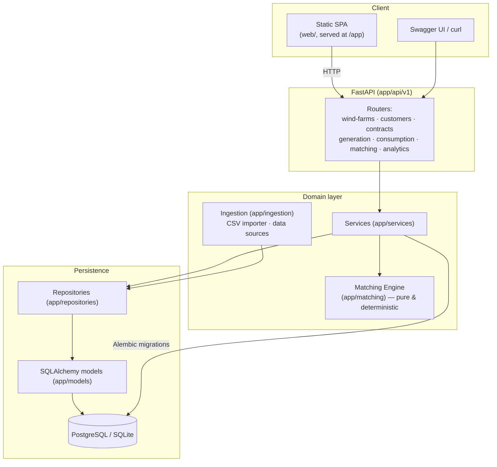
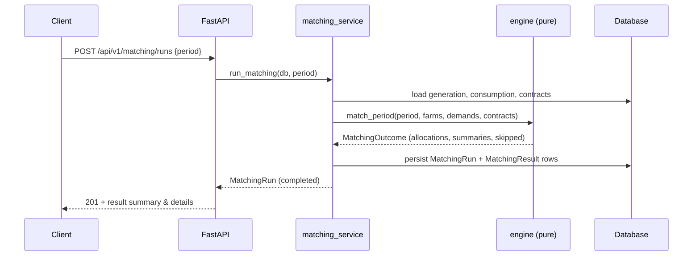

# 架構（Architecture）

## 總覽

綠電媒合平台是一個分層的 FastAPI 應用。**媒合引擎是一個純粹、可重現的核心**,不做任何
I/O;圍繞它的一切——持久化、資料匯入、API、Web UI——都是可替換的外層。

## 分層

| 層 | 套件 | 職責 |
|-------|---------|----------------|
| API | `app/api/v1` | HTTP 路由、請求／回應 schema、狀態碼 |
| Schemas | `app/schemas` | Pydantic v2 驗證與序列化契約 |
| Services | `app/services` | 商業邏輯、流程編排、交易 |
| Matching | `app/matching` | 純粹、可重現的分配引擎(無 I/O) |
| Ingestion | `app/ingestion` | CSV 匯入、可插拔的 `DataSource`、mock 產生器 |
| Repositories | `app/repositories` | ORM 上的泛型 CRUD 資料存取 |
| Models | `app/models` | SQLAlchemy 2.x ORM 實體 |
| Core | `app/core` | 設定、領域例外 |
| DB | `app/db` | engine、session、declarative base |

## 設計原則

- **核心純粹、邊緣可替換。** `match_period()` 吃單純的 dataclass、回傳單純的 dataclass
  ——極容易單元測試,並同時被媒合服務(持久化的執行)與分析(即時計算)共用。
- **可重現。** 合約以一個完整且穩定的順序處理,沒有任何隨機性。相同輸入 ⇒ 完全相同的輸出。
- **與資料庫無關。** 模型避開特定廠商的型別,所以同一份程式碼在 SQLite(本機／測試)
  與 PostgreSQL(Docker／正式)上跑法完全一致。
- **不做假的資料來源。** 在真實公開 API 尚未確認可用之處,平台提供 `DataSource` 介面
  + CSV 匯入 + 可重現的 `MockDataGenerator`,以及一個 `PublicDataAdapter` 預留位——
  真的要實作前,它必須先遵守上游的 ToS / robots.txt。

## 請求生命週期(一次媒合執行)

另見 [`domain-model.md`](domain-model.md) 與 [`matching-rules.md`](matching-rules.md)。
