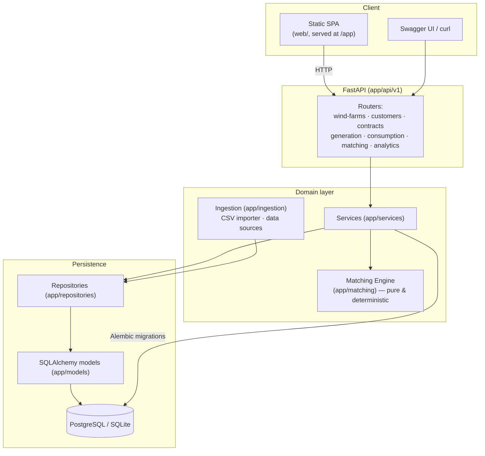
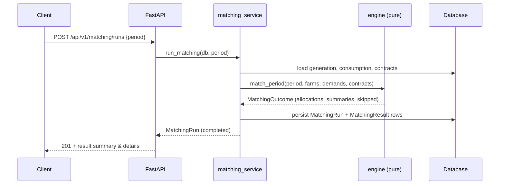

# Architecture

## Overview

The Energy Matching Platform is a layered FastAPI application. The **matching
engine is a pure, deterministic core** with no I/O; everything around it —
persistence, ingestion, API, web UI — is a replaceable outer layer.

## Layers

| Layer | Package | Responsibility |
|-------|---------|----------------|
| API | `app/api/v1` | HTTP routing, request/response schemas, status codes |
| Schemas | `app/schemas` | Pydantic v2 validation & serialization contracts |
| Services | `app/services` | Business logic, orchestration, transactions |
| Matching | `app/matching` | Pure deterministic allocation engine (no I/O) |
| Ingestion | `app/ingestion` | CSV import, pluggable `DataSource`, mock generator |
| Repositories | `app/repositories` | Generic CRUD data-access over the ORM |
| Models | `app/models` | SQLAlchemy 2.x ORM entities |
| Core | `app/core` | Settings, domain exceptions |
| DB | `app/db` | Engine, session, declarative base |

## Design principles

- **Pure core, replaceable edges.** `match_period()` takes plain dataclasses and
  returns plain dataclasses — trivially unit-testable and reused by both the
  matching service (persisted runs) and analytics (on-the-fly).
- **Deterministic.** Contracts are processed in a total, stable order; there is
  no randomness. Same input ⇒ identical output.
- **Database-agnostic.** Models avoid vendor-specific types, so the exact same
  code runs on SQLite (local/tests) and PostgreSQL (Docker/production).
- **No fake data sources.** Where a real public API is not confirmed available,
  the platform exposes a `DataSource` interface + CSV import + a deterministic
  `MockDataGenerator`, and a `PublicDataAdapter` placeholder that must honour the
  upstream's ToS / robots.txt before it is ever implemented.

## Request lifecycle (matching run)

See also [`domain-model.md`](domain-model.md) and
[`matching-rules.md`](matching-rules.md).
