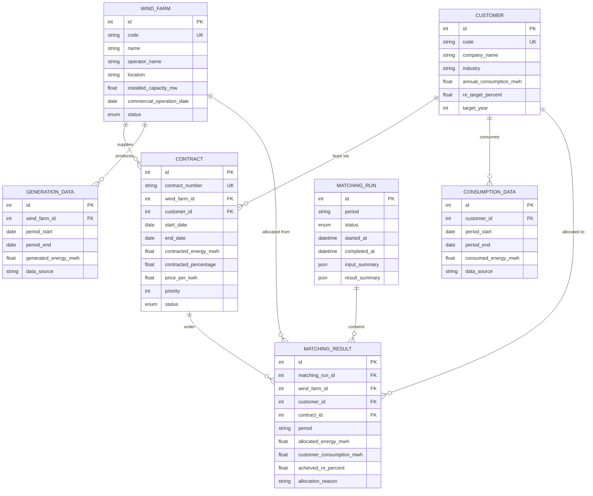

# 領域模型（Domain model）

所有電量以 **MWh** 儲存;百分比為 0–100。定義在 `app/models/`。

## 實體關聯圖（ERD）

## 關鍵區別

系統刻意把下面這四個量**分開**——合約比例*不等於*實際交付的綠電:

| 概念 | 欄位 | 意義 |
|---------|-------|---------|
| 合約比例 | `contracted_percentage` | 約定佔某風場產出的比例(上限) |
| 合約電量 | `contracted_energy_mwh` | 約定的固定月度電量(上限) |
| 實際發電 | `generation_data.generated_energy_mwh` | 風場真正發了多少 |
| 實際用電 | `consumption_data.consumed_energy_mwh` | 客戶真正用了多少 |
| **最終分配** | `matching_result.allocated_energy_mwh` | 引擎的結果,受上述所有量所限 |
| RE 達成 | `matching_result.achieved_re_percent` | `分配 ÷ 用電 × 100` |

## 列舉（Enumerations）

- **WindFarmStatus**：`planning`、`under_construction`、`operational`、`decommissioned`
- **ContractStatus**：`pending`、`active`、`expired`、`terminated`
- **MatchingRunStatus**：`pending`、`running`、`completed`、`failed`

只有 `active` 且 `[start_date, end_date]` 涵蓋該期間的合約會參與媒合
(見 [`matching-rules.md`](matching-rules.md))。
