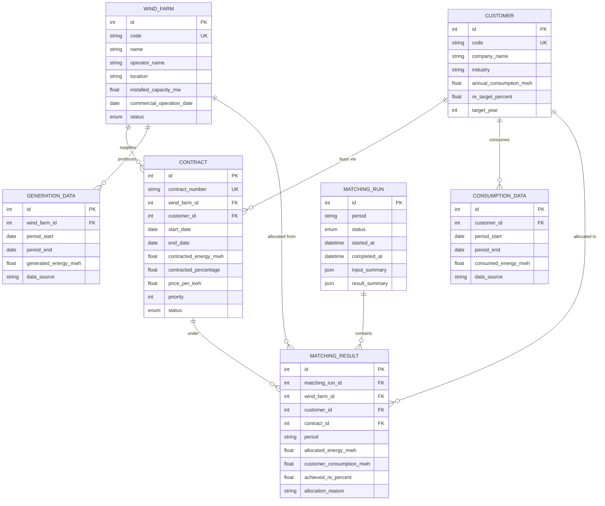

# Domain model

All energy is stored in **MWh**; percentages are 0–100. Defined in `app/models/`.

## Entity–relationship diagram

## Key distinctions

The system deliberately keeps these four quantities **separate** — a contract
ratio is *not* the same as the delivered green energy:

| Concept | Field | Meaning |
|---------|-------|---------|
| Contract share | `contracted_percentage` | Agreed share of a farm's output (a cap) |
| Contract volume | `contracted_energy_mwh` | Agreed fixed monthly volume (a cap) |
| Actual generation | `generation_data.generated_energy_mwh` | What the farm really produced |
| Actual consumption | `consumption_data.consumed_energy_mwh` | What the customer really used |
| **Final allocation** | `matching_result.allocated_energy_mwh` | Result of the engine, bounded by all of the above |
| RE achievement | `matching_result.achieved_re_percent` | `allocated ÷ consumption × 100` |

## Enumerations

- **WindFarmStatus**: `planning`, `under_construction`, `operational`, `decommissioned`
- **ContractStatus**: `pending`, `active`, `expired`, `terminated`
- **MatchingRunStatus**: `pending`, `running`, `completed`, `failed`

Only `active` contracts whose `[start_date, end_date]` covers the period take
part in matching (see [`matching-rules.md`](matching-rules.md)).
