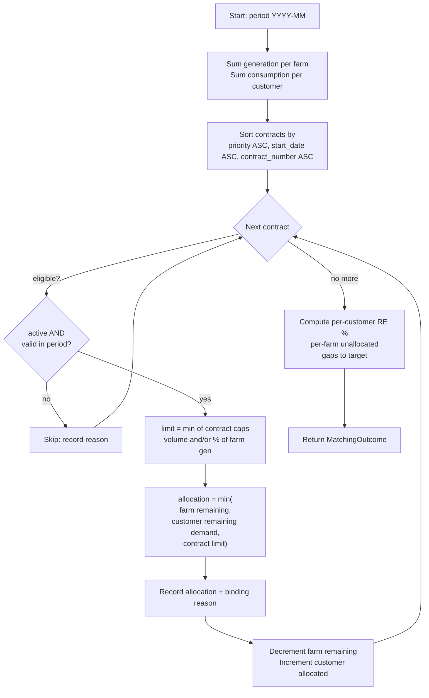

# Matching rules

The matching engine (`app/matching/engine.py`) allocates each wind farm's monthly
generation to customers through their contracts, deterministically.

## Inputs

For a single period (one calendar month, `YYYY-MM`):

- **Farm supply** — each farm's total `generated_energy_mwh` that month.
- **Customer demand** — each customer's total `consumed_energy_mwh` that month.
- **Contracts** — every contract, with its priority, validity window, status and
  cap (`contracted_energy_mwh` and/or `contracted_percentage`).

## Process flow



## Allocation rules

1. **Period = one month.** Generation and consumption are aggregated to the month.
2. **No double allocation.** Each farm's generated energy is a finite pool;
   `Σ allocations from a farm ≤ its generation`.
3. **No over-consumption.** `Σ allocations to a customer ≤ its consumption`.
4. **Contract cap.** A contract never allocates more than the tighter of its
   fixed volume and its percentage-of-generation share.
5. **Priority.** Contracts are served by ascending `priority` (lower number =
   higher priority). Ties break by earlier `start_date`, then `contract_number` —
   a total, stable ordering.
6. **Eligibility.** Only `active` contracts with `start_date ≤ period_end` and
   `end_date ≥ period_start` participate. Others are skipped with a recorded
   reason (not started / already ended / not active).
7. **Auditability.** Every allocation records the binding constraint
   ("limited by wind farm supply / customer demand / contract cap").
8. **Determinism.** No randomness; identical inputs give identical outputs.

## Formulas

```
contract_limit      = min( contracted_energy_mwh?,
                           contracted_percentage/100 × farm_generation? )
allocation          = max(0, min(farm_remaining, customer_remaining, contract_limit))
achieved_re_percent = allocated_to_customer / customer_consumption × 100
target_energy_mwh   = customer_consumption × re_target_percent / 100
gap_to_target_mwh   = max(0, target_energy_mwh − allocated_to_customer)
utilization_percent = allocated_from_farm / farm_generation × 100
```

## Boundary scenarios (all covered by the demo data)

| Scenario | How it shows up |
|----------|-----------------|
| Under-supply | Large customer (TSMC) — RE% < target, positive gap |
| Over-supply | Small farm (Zhongtun) generates more than its single small buyer uses → unallocated surplus |
| Consumption below contract cap | Customer capped by demand, not by the contract |
| Different RE targets | 100 % / 60 % / 80 % / 50 % across customers |
| Different priorities | Higher-priority contract on a shared farm served first |
| Contract inactive | Expired (`PPA-2020-007`) and pending (`PPA-2025-008`) are skipped |

## Limitations & future optimisation

- Monthly granularity only — no 8760-hour time-matching yet (Phase 2).
- Greedy priority allocation, not a global optimum. A future phase can replace
  the greedy pass with a linear program that minimises total gap or cost while
  respecting the same constraints (Phase 3).
- No inter-farm portfolio balancing or curtailment forecasting yet.
