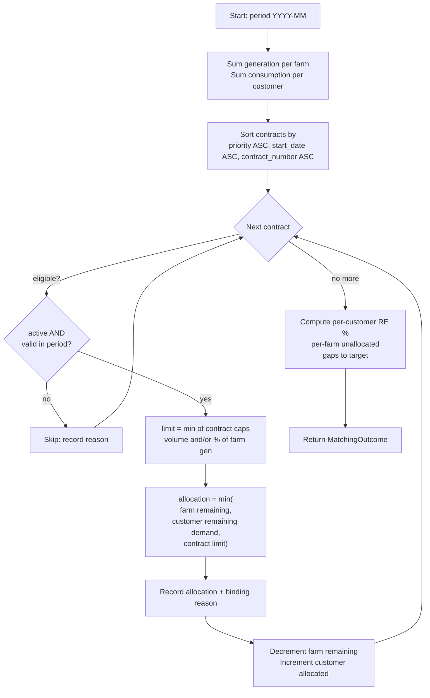

# 媒合規則（Matching rules）

媒合引擎（`app/matching/engine.py`）以可重現的方式,把每座風場的月度發電量,透過合約分配給客戶。

## 輸入

對單一期間(一個日曆月,`YYYY-MM`):

- **風場供給** — 每座風場當月的 `generated_energy_mwh` 總量。
- **客戶需求** — 每位客戶當月的 `consumed_energy_mwh` 總量。
- **合約** — 每一份合約,含其優先序、有效期間、狀態,以及上限
  (`contracted_energy_mwh` 和／或 `contracted_percentage`)。

## 流程



## 分配規則

1. **期間 = 一個月。** 發電與用電都彙整到月。
2. **不重複分配。** 每座風場的發電量是有限的池子;`Σ 從某風場的分配 ≤ 其發電量`。
3. **不超用。** `Σ 分配給某客戶的量 ≤ 其用電量`。
4. **合約上限。** 一份合約分配的量,絕不超過「固定電量」與「佔發電量的比例」兩者中較緊者。
5. **優先序。** 合約依 `priority` 由小到大服務(數字越小 = 優先序越高)。平手時先看較早的
   `start_date`、再看 `contract_number`——一個完整、穩定的排序。
6. **資格。** 只有 `active` 且 `start_date ≤ period_end`、`end_date ≥ period_start` 的合約會
   參與。其餘會被跳過並記下理由(尚未開始／已結束／非有效)。
7. **可稽核。** 每筆分配都記下卡住它的約束(「受限於風場供給／客戶需求／合約上限」)。
8. **可重現。** 沒有隨機性;相同輸入給出相同輸出。

## 公式

```
contract_limit      = min( contracted_energy_mwh?,
                           contracted_percentage/100 × farm_generation? )
allocation          = max(0, min(farm_remaining, customer_remaining, contract_limit))
achieved_re_percent = allocated_to_customer / customer_consumption × 100
target_energy_mwh   = customer_consumption × re_target_percent / 100
gap_to_target_mwh   = max(0, target_energy_mwh − allocated_to_customer)
utilization_percent = allocated_from_farm / farm_generation × 100
```

## 邊界情境(示範資料皆已涵蓋)

| 情境 | 如何呈現 |
|----------|-----------------|
| 供給不足 | 大客戶(台積電)——RE% < 目標,缺口為正 |
| 供給過剩 | 小風場(中屯)發的電多於它唯一的小買家所需 → 出現未分配的餘電 |
| 用電低於合約上限 | 客戶被需求卡住,而非被合約卡住 |
| 不同 RE 目標 | 客戶間分別是 100% / 60% / 80% / 50% |
| 不同優先序 | 共用風場上,優先序較高的合約先被服務 |
| 合約非有效 | 已到期(`PPA-2020-007`)與待生效(`PPA-2025-008`)會被跳過 |

## 限制與未來最佳化

- 目前只有月度粒度——尚無 8760 小時的時間媒合(Phase 2)。
- 存在兩種媒合策略:上面這個可重現的貪婪優先序引擎(快、依優先序、非全域最佳),
  以及下方說明的 MILP 經濟最佳化器(`optimize_period`、`GET /matching/optimize`),
  它在相同約束下求全域最佳解(Phase 3)。
- 尚未有跨風場的組合平衡或減發(curtailment)預測。

## 經濟最佳化媒合(optimizer)

`app/matching/optimizer.py::optimize_period` 是第二種媒合策略:不依優先序貪婪分配,
而是以 MILP(PuLP + 內建 CBC)對整個期間**全域求解**。

**目標**:最大化售電端總毛利。先將毛利正規化到 `[−1, 1]`:
`margin_term = Σ alloc×1000×margin / MARGIN_UB`,再扣除**尺度無關的懲罰階層**
`P_RE(1e6) ≫ P_SITE(1e3) ≫ margin_term ≫ ε(1e-6)`,依序對應 RE 缺口、最少案場缺口、
毛利本身、案場數破平局。

**決策變數**:每筆合格合約各有 `alloc[c] ≥ 0`(MWh)與 `use[c] ∈ {0,1}`(是否啟用)。

**約束**:場供給(`Σalloc ≤ 發電量`)、客戶需求(`Σalloc ≤ 用電量`)、合約上限與啟用
連結(`alloc ≤ cap × use`)、最小分配% 為**硬**下限(啟用中的案場須至少提供該客戶
用電量的 `min_site_allocation_percent`%,且此連結使啟用永遠對應嚴格大於 0 的分配,
不能靠空 flag 湊數)、最少案場數與 RE 目標皆為**軟**約束(以 slack 變數表示,恆可行,
可行時等效硬約束、不可行時自動最小化缺口)。

**可重現性**:單執行緒求解(`PULP_CBC_CMD(threads=1, msg=0)`)、合約以穩定序建模、
目標以 ε 項破平局,同一輸入(即使重新排序)求解結果逐筆相同。

## 時段時間電價媒合(slot matcher)

`app/matching/slot_engine.py::match_slots` 是第三種媒合路徑,與月度引擎、MILP 最佳化並存
(月度引擎不受影響)。時段定義為尖峰 / 半尖峰 / 離峰(`TimeSlot`),季別由月份推導
(`app/matching/tou.py::season_of`):6–9 月為夏月,其餘為非夏月;整個期間同一季。

演算法依 `SLOT_ORDER`(尖峰 → 半尖峰 → 離峰)逐時段、逐合格合約(依 priority/start_date/
contract_number 穩定排序)貪婪分配:
`alloc = min(該時段場剩餘發電, 該時段客戶剩餘用電, 合約% 上限, 合約月度能量預算)`。
`contracted_percentage` 是該時段發電量的百分比上限(逐時段各自計算);`contracted_energy_mwh`
則是**跨三時段共用的月度能量預算**,尖峰時段依 `SLOT_ORDER` 優先取用。跨時段的客戶/案場
summary 把各時段 allocated 與 consumption 加總後再算 RE%,即專利式6 的跨時段 RE 聚合。

月度引擎的 `_sum_generation`/`_sum_consumption`(`app/services/matching_service.py`)加總的是
該月**所有**列,不分 `time_slot`,因此時段列(三時段加總即為月度總量)不會破壞月度引擎的正確性;
但這仰賴一個**僅靠慣例維持**的互斥不變量——同一(案場/客戶, 月份)只能存在月度列**或**時段列
其中一種,不能兩者並存。產生器(`scripts/generate_slot_profiles.py`)會刪除月度列以維持此不變量,
但其他寫入路徑(`POST /generation`、CSV 匯入)並未強制檢查,若在已有時段列的情況下又插入月度列,
會導致月度引擎重複計算。

`app/services/slot_matching_service.py` 計算時段別經濟:用電端均價與增加成本以**逐時段灰電價**
(`tou.grey_price(season, slot)`)計算,體現尖峰灰電貴、尖峰供綠電更省的經濟意義;售電端毛利
則沿用單一費率的綠電轉供價(`contract.price_per_kwh`),不逐時段。

**專利對應**:本階段實作專利式2/3/4(逐時段轉供量 = min(發電分配, 用電分配))、式5
(`T_slot ≤ G_slot`,任一時段轉供量不超過該時段發電分配)、式6(跨時段 RE 聚合)以及時間電價
(逐時段灰電計價)。沿用 P3 的 `min_th`(`min_site_allocation_percent`)與 `limit_gen`
(`min_sites_per_customer`)概念、P2 的售電端毛利計算。台電**二次匹配**(同時段餘電再分配)與
式7(最小化餘電目標式)留待 P4b。
